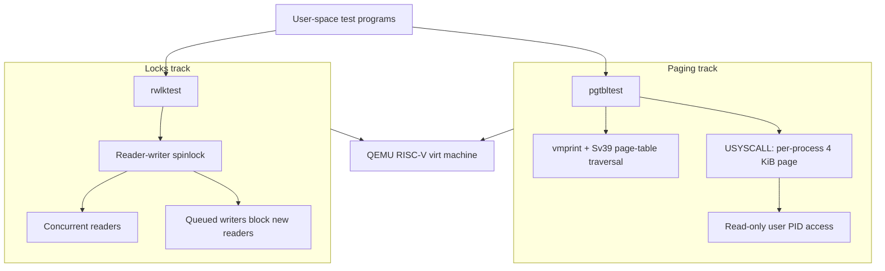

# xv6 Kernel Extensions: Virtual Memory & Concurrency

[](https://github.com/vedantdotpy/xv6-kernel-extensions)
[](https://github.com/vedantdotpy/xv6-kernel-extensions)
[](https://github.com/vedantdotpy/xv6-kernel-extensions)
[](https://github.com/vedantdotpy/xv6-kernel-extensions)

An xv6/RISC-V kernel engineering project focused on virtual-memory introspection, a kernel-to-user shared syscall page, and writer-priority reader-writer synchronization.

<p align="center">
  <a href="#engineering-at-a-glance">Metrics</a> •
  <a href="#choose-a-track">Choose a track</a> •
  <a href="#architecture">Architecture</a> •
  <a href="#validation">Validation</a> •
  <a href="#how-to-build--run">Run it</a>
</p>

## Engineering at a Glance

| Metric | Evidence in this repository |
| --- | --- |
| **2 runnable kernel tracks** | Separate paging and locking implementations, each with its own build configuration |
| **4 virtual CPUs** | Lock harness pins the QEMU lock configuration to 4 CPUs and spawns 4 test processes |
| **64 forked address-space checks** | `pgtbltest` verifies the user-visible PID mapping across 64 child processes |
| **3-level Sv39 page tables** | Virtual-memory implementation targets RISC-V Sv39 translation |
| **4 KiB page granularity** | `PGSIZE` is 4,096 bytes; each process receives a dedicated `USYSCALL` page |
| **128 MiB emulated memory** | QEMU runs with a 128 MiB memory configuration |
| **1M-iteration lock stress loops** | Reader and writer critical-section tests each exercise million-iteration loops |
| **177 commits** | Version-controlled implementation history in this repository |

## Choose a Track

| Start here | Focus | Main proof point | Key command |
| --- | --- | --- | --- |
| [`xv6-labs(Paging)`](./xv6-labs(Paging)) | Page tables and kernel/user memory boundary | A read-only user mapping exposes each process ID without a system call | `pgtbltest` |
| [`xv6-labs(Locks)`](./xv6-labs(Locks)) | Synchronization under contention | A writer-priority reader-writer lock is exercised by 4 processes on 4 CPUs | `rwlktest` |

## Architecture



The two tracks are intentionally independent so each extension can be built, inspected, and tested in isolation.

## What I Built

### Virtual-memory extensions

- Added a per-process, user-readable/kernel-writable `USYSCALL` mapping that exposes the process ID without a system call.
- Implemented `ugetpid()` and a 64-process fork test that cross-checks the shared-page PID against `getpid()`.
- Added recursive `vmprint` page-table traversal and a user-facing page-table inspection test.
- Preserved xv6 user/kernel address-space protections while integrating the additional mapping.

### Concurrency extensions

- Implemented a reader-writer spinlock with concurrent readers and writer priority.
- Prevented new readers from bypassing a queued writer, addressing writer starvation at the lock-policy level.
- Added a 4-process/4-CPU test harness covering simultaneous readers, exclusive writers, writer priority, and multiple waiting writers.
- Included lock-statistics plumbing plus allocator and buffer-cache stress-test programs for lock-focused validation.

<details>
<summary><strong>Implementation notes</strong></summary>

<br>

- The paging track allocates one `USYSCALL` page per process, maps it with `PTE_R | PTE_U`, initializes it with that process’s PID, and releases it during process cleanup.
- The lock tracks active readers, an active writer, and waiting writers. A reader acquires the lock only when no writer is active or queued; this gives waiting writers priority.
- The lock test checks reader concurrency, writer exclusivity, one waiting writer, and two waiting writers.

</details>

## Validation

| Test | What it exercises |
| --- | --- |
| `pgtbltest` | Page-table printing, shared `USYSCALL` PID mapping, and 64 forked child checks |
| `rwlktest` | 4-process reader-writer correctness and writer-priority behavior on 4 CPUs |
| `kalloctest` | Concurrent allocator allocation/free and stealing paths |
| `bcachetest` | Concurrent buffer-cache behavior and eviction paths |
| `usertests` | Broad xv6 regression coverage |

<details>
<summary><strong>What success looks like</strong></summary>

<br>

- `pgtbltest` ends with `pgtbltest: all tests succeeded` after printing user and kernel page-table data.
- `rwlktest` reports `4/4 CPUs succeeded`; individual worker processes return success only when all synchronization checks pass.
- `usertests` is the regression check after either extension is built.

</details>

## How to Build & Run

You need a RISC-V toolchain and QEMU.

- **macOS:** `brew install riscv-gnu-toolchain qemu`
- **Linux:** `sudo apt-get install git build-essential gdb-multiarch qemu-system-misc gcc-riscv64-linux-gnu binutils-riscv64-linux-gnu`

### Paging track

```bash
cd "xv6-labs(Paging)"
make clean
make qemu
```

Then, at the xv6 shell (`$`), run:

```bash
$ pgtbltest
$ usertests
```

### Locking track

```bash
cd "xv6-labs(Locks)"
make clean
make qemu
```

Then, at the xv6 shell (`$`), run:

```bash
$ rwlktest
$ kalloctest
$ bcachetest
$ usertests
```

## Technical Details

- **Architecture:** 64-bit RISC-V
- **Memory model:** Sv39 paging (3 levels), 4 KiB pages
- **Runtime:** QEMU `virt` machine, 128 MiB RAM; locking track uses 4 CPUs
- **Implementation:** C and RISC-V assembly
- **Base system:** MIT PDOS xv6-riscv / 6.S081 teaching kernel

## Acknowledgments

This project builds on the xv6-riscv operating system developed by MIT PDOS for the 6.S081 Operating Systems Engineering course.


